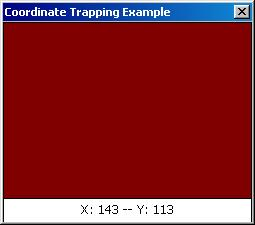



## Coordinate Trapping Example

### Description

This code is meant to show how to grab the mouse's coordinates in a picture box. This example uses MouseDown, but MouseMove also works. This is really handy for coding graphical chat clients.
 
### More Info
 

             |
---                |---
**Submitted On**   |2000-12-18 03:05:26
**By**             |[Nate Reindl \(Ram\)](https://github.com/Planet-Source-Code/PSCIndex/blob/master/ByAuthor/nate-reindl-ram.md)
**Level**          |Intermediate
**User Rating**    |3.7 (11 globes from 3 users)
**Compatibility**  |VB 6\.0
**Category**       |[Miscellaneous](https://github.com/Planet-Source-Code/PSCIndex/blob/master/ByCategory/miscellaneous__1-1.md)
**World**          |[Visual Basic](https://github.com/Planet-Source-Code/PSCIndex/blob/master/ByWorld/visual-basic.md)
**Archive File**   |[CODE\_UPLOAD1279412182000\.zip](https://github.com/Planet-Source-Code/nate-reindl-ram-coordinate-trapping-example__1-13674/archive/master.zip)

